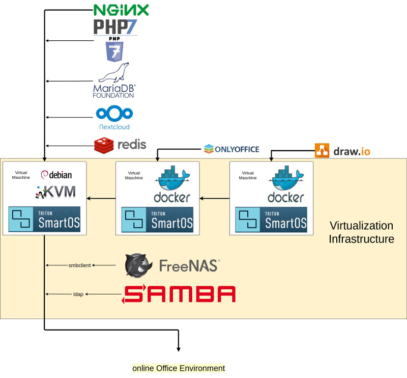

Requirement
===========

```
* VM with 12 GB RAM (4 GB for PHP7-FPM)

* Debian 8 (SmartOS LX-Zone Image)
                     |
                     ---> FULL-Install tested on: 9a8d53c0-c15b-11e6-9c4f-3bcedc82f8e1

* Debian 9 (SmartOS LX-Zone Image)
                     |
                     ---> PARTIAL-Install tested on: 63d6e664-3f1f-11e8-aef6-a3120cf8dd9d
                        |
                        ---> MariaDB Server ERROR
                        |  | mariadb.service:
                        |  | Failed at step NO_NEW_PRIVILEGES spawning /usr/sbin/mysqld: Invalid argument
                        |  |
                        |  ---> requires stand-alone Container with Debian 8 mariadb-server
                        |
                        ---> phpsessionclean.service ERROR

* Debian 9 (SmartOS KVM)
                     |
                     ---> FULL-Install tested on: Debian 9.5.0 stable
```

* /nextcloud_addon_parameter config file (optional)

```
╭─root at assg15-vlan-kvm-nextcloud4 in / using
╰─○ cat /nextcloud_addon_parameter

ONLYOFFICE_URL="https://onlyoffice.yourdomain.tld"

USER_LDAP_HAS_MEMBEROF_FILTER_SUPPORT="1"
USER_LDAP_AGENT_PASSWORD=""
USER_LDAP_BASE_0="OU=Users,DC=YOURDOMAIN,DC=tld"
USER_LDAP_BASE_GROUPS="OU=Users,DC=YOURDOMAIN,DC=tld"
USER_LDAP_BASE_USERS="OU=Users,DC=YOURDOMAIN,DC=tld"
USER_LDAP_CONFIGURATION_ACTIVE="1"
USER_LDAP_DN="CN=ldapuser,OU=Users,DC=YOURDOMAIN,DC=tld"
USER_LDAP_GROUP_FILTER="(&(|(objectclass=group)))"
USER_LDAP_HOST="XXX.XXX.XXX.XXX"
USER_LDAP_LOGIN_FILTER_0="(&(&(|(objectclass=person)))(samaccountname=%uid))"
USER_LDAP_LOGIN_FILTER_MODE="1"
USER_LDAP_PORT="389"
USER_LDAP_TLS="0"
USER_LDAP_USERFILTER_OBJECTCLASS="person"
USER_LDAP_USERLIST_FILTER="(&(|(objectclass=person)))"

╭─root at assg15-vlan-kvm-nextcloud4 in / using
╰─○
```

Core Components
===============

* nginx
* php7
* mariadb
* nextcloud 13

Additional Components
=====================

* php-opcache
* php-apcu (optional)
* imagemagick
* ffmpeg
* redis-server

Progress
========

| Service / Install                              | Progress                    | Status |
|---                                             |---                          |---     |
| environment check                              | implemented                 | OK     |
| environment prepare                            | implemented                 | OK     |
|                                                |                             |        |
| nginx                                          | implemented                 | OK     |
| nginx adjustments                              | implemented                 | OK     |
|                                                |                             |        |
| php7                                           | implemented                 | OK     |
| php7 adjustments                               | implemented                 | OK     |
|                                                |                             |        |
| mariadb                                        | implemented                 | OK     |
| mariadb adjustments                            | implemented                 | OK     |
|                                                |                             |        |
| nextcloud                                      | implemented                 | OK     |
|                                                |                             |        |
| ffmpeg                                         | implemented                 | OK     |
| php-opcache                                    | implemented                 | OK     |
| php-apcu (optional)                            | implemented                 | IGNORE |
|                                                |                             |        |
| redis-server                                   | implemented                 | OK     |
| redis-server adjustments                       | implemented                 | OK     |
|                                                |                             |        |
| nextcloud addon: files_pdfviewer               | activation                  | OK     |
| nextcloud addon: user_ldap                     | activation                  | OK     |
| nextcloud addon: files_external                | activation                  | OK     |
|                                                |                             |        |
| nextcloud third party addon: polls             | download & activation       | OK     |
| nextcloud third party addon: talk (spreed)     | download & activation       | OK     |
| nextcloud third party addon: onlyoffice        | download & activation       | OK     |
| nextcloud third party addon: drawio            | download & activation       | OK     |
|                                                |                             |        |
| nextcloud: onlyoffice                          | automatic setup preparation | OK     |
| nextcloud: active-directory / ldap             | automatic setup preparation | OK     |
| nextcloud: smb / cifs                          | arranged by hand            | OK     |
| nextcloud: draw.io                             | arranged by hand            | OK     |
|                                                |                             |        |

Check Redis-Server Traffic
==========================

* MONITOR

```
╭─root at assg15-vlan-kvm-nextcloud4 in /var/log/redis using
╰─○ redis-cli -s /var/run/redis/redis.sock MONITOR
OK

1533127062.584519 [0 unix:/var/run/redis/redis.sock] "GET" "6c64b6970f7f5d016ebfe53aa90ad503/AutoloaderOC_DB"
1533127062.584767 [0 unix:/var/run/redis/redis.sock] "GET" "6c64b6970f7f5d016ebfe53aa90ad503/AutoloaderOC_DB_StatementWrapper"
1533127062.589040 [0 unix:/var/run/redis/redis.sock] "GET" "6c64b6970f7f5d016ebfe53aa90ad503/AutoloaderOC_Helper"

╭─root at assg15-vlan-kvm-nextcloud4 in /var/log/redis using
╰─○
```

* AUTH Test (without authentication)

```
╭─root at assg15-vlan-kvm-nextcloud4 in /var/log/redis using
╰─○ redis-cli -s /var/run/redis/redis.sock
redis /var/run/redis/redis.sock> ping
PONG
redis /var/run/redis/redis.sock>

╭─root at assg15-vlan-kvm-nextcloud4 in /var/log/redis using
╰─○
```

Free Nextcloud Security Scan
============================

* https://scan.nextcloud.com/

Scheme
======



Sources
=======

* https://goneuland.de/wordpress/debian-8-jessie-nextcloud-mit-nginx-mariadb-und-php7-installieren/
* https://www.c-rieger.de/nextcloud-installation-guide-debian-stretch/
* https://github.com/riegercloud/install-nextcloud
* https://bayton.org/docs/nextcloud/installing-nextcloud-on-ubuntu-16-04-lts-with-redis-apcu-ssl-apache/

